# PRIMA SECOND HOME

Aplikácia pre **hostí** ubytovní PRIMA — ľudí, ktorí v budovách bývajú (nie pre B2B klientov).
PWA — beží v prehliadači aj ako appka na ploche telefónu, otvára sa z QR kódu na lístku pri ubytovaní.

**Stack:** Vite + React 18 · inline tokeny PRIMA (rovnaké ako PRIMA RE SERVICE / PRIMA TOOLS) ·
Lucide ikony · 12 jazykov UI · Supabase (v1.1) · Cloudflare Workers Builds.

> **English summary:** guest app for people staying in PRIMA worker accommodation. Research on who
> the guests are and what they need is in [docs/RESEARCH.md](docs/RESEARCH.md); the product
> specification in [docs/PRODUCT_SPEC.md](docs/PRODUCT_SPEC.md); integration with Casist,
> PRIMA RE SERVICE and PRIMA TOOLS in [docs/INTEGRATION.md](docs/INTEGRATION.md).
> This version is a working demo (data stored in the browser), ready for the Supabase backend.

---

## Rýchly štart

```bash
npm install
npm run dev          # http://localhost:5174 — DEMO režim (bez Supabase)
npm run check        # kontrola importov + kompletnosť prekladov (spusti pred každým commitom)
npm test             # node --test
npm run build        # dist/
```

Demo prístupové kódy (obrazovka „Zadajte prístupový kód"):

| Kód | Priezvisko (prvé 3 písmená) | Budova | Izba |
|---|---|---|---|
| `IC23-1102` | Kovalenko → `KOV` | PRIMA IC 23 | 111/2 |
| `NUK-0340` | Dela Cruz → `DEL` | PRIMA Nukleon | 340 |
| `GAL-0201` | Karimov → `KAR` | PRIMA Galanta | 201 |

Bez kódu funguje **informačný režim** (výber budovy → info, pravidlá, sprievodcovia, kontakty).

## Čo appka robí (v1 demo)

- výber jazyka (SK, EN, UK, RU, SR, RO, HU, VI, HI, NE, UZ, TL) a prihlásenie kódom z lístka
- potvrdenie ubytovacieho poriadku v jazyku hosťa
- domov: môj pobyt, najbližšie upratovanie, oznamy budovy
- **nahlásenie problému** (kategórie zladené s RE SERVICE, miesto, fotka, popis, súrnosť) a sledovanie stavu
- služby: práčovňa, upratovanie navyše, výmena bielizne, parkovanie, prístupová karta, zmena izby (→ koordinátor), iné
- dokumenty: hlásenie pobytu, žiadosť o potvrdenie o ubytovaní
- info o budove (adresa, tip na príchod, recepcia, WiFi, kuchyňa, práčovňa, nočný kľud, odpad…), pravidlá
- sprievodcovia „Život na Slovensku" (EN/SK/UK/RU): prvé dni, cudzinecká polícia, zdravie, peniaze, doprava, pomoc
- kontakty: recepcia, koordinátor firmy, kancelária, tiesňové linky, IOM
- hodnotenie pobytu (aj anonymne), profil, offline shell

## Kde čo je

```
src/
  main.jsx, App.jsx        vstup, jazyk, session, routing (hash), gating pravidiel
  router.js                hash router bez závislosti (#/requests/<id>)
  app-context.js           stay / property / content pre obrazovky
  config/                  theme.js (tokeny), app-config.js, languages.js, properties.js (prevádzky), catalog.js (kategórie, služby)
  i18n/                    index.js (useT, lazy načítanie jazykov), translations/<lang>.js
  content/                 dlhší obsah: pravidlá, sprievodcovia, info o budove (en, sk, uk, ru)
  data/                    adapter.js (jediný vstup do dát), demo-store.js (localStorage), seed.js
  domain/                  room-codes.js (kódy izieb ako RE SERVICE), request-status.js, ticket-bridge.js, cleaning.js
  lib/                     format.js (dátumy), photo.js (kompresia fotiek)
  ui/                      icons.jsx, primitives.jsx, GlobalStyles.jsx, PrimaLogo.jsx, LangPicker.jsx
  shell/                   hlavička + spodná navigácia + offline banner
  screens/                 obrazovky podľa oblasti
supabase/                  schéma (migrácia) + edge funkcia mostu do RE SERVICE — v1.1, návrh
tools/                     make-icons.mjs, verify-imports.mjs, check-i18n.mjs
test/                      node --test
docs/                      RESEARCH.md, PRODUCT_SPEC.md, INTEGRATION.md, TRANSLATION_STATUS.md
```

## Pravidlá (rovnaké ako v sesterských repozitároch)

- **Texty len cez `t()`** — kľúč do `src/i18n/translations/en.js` (referencia) a do všetkých ostatných jazykov;
  `npm run check` inak spadne.
- **Farby len z tokenov** `C` a `BRAND` (`src/config/theme.js`). Žiadny Tailwind, žiadne CSS premenné.
- **Ikony len Lucide** cez `src/ui/icons.jsx` (explicitný zoznam kvôli tree-shakingu). Nikdy emoji.
- **`function X()`**, importy s príponou, žiadny `index.js` s `export *`.
- Jedna zmena = jeden commit. `node tools/verify-imports.mjs` musí dať 0 chýb.

## Nasadenie

Cloudflare Workers Builds ako pri sesterských appkách: `main` → produkcia, čokoľvek iné → staging
(`vite.config.js` číta `WORKERS_CI_BRANCH`). Bez `VITE_SUPABASE_URL` beží build v DEMO režime.
Navrhovaná doména: `home.primare.sk`.

## Ďalší krok (v1.1)

Založiť Supabase projekt pre hostí, nasadiť `supabase/migrations/`, napísať Supabase adaptér s rovnakým
rozhraním ako `src/data/demo-store.js`, modul „Hostia" v PRIMA TOOLS (kódy pri check-ine) a most do
RE SERVICE — podrobne v [docs/INTEGRATION.md](docs/INTEGRATION.md).

## v2 — Tarif (8. 9. 2026)

Návrh dizajnu a funkcionality podľa content packu TARIF: `docs/NAVRH_V2.md`, plátno s obrazovkami
https://claude.ai/code/artifact/dba3de52-e581-402e-a4cd-a7808c9b6c02, rešerš `docs/RESEARCH-TARIF.md`.
Nové v appke: balíky obsahu na budovu (`src/content/packs/`), rezervácia práčovne (`#/laundry`),
Okolie budovy (`#/around`), Núdzová karta (`#/emergency`), povolenie na pobyt s pripomienkami
(Dokumenty), súkromné nahlásenie (`#/private`). Demo kód Tarif: `TARIF-2214`, priezvisko `Ivanenko`.

## v3 — dizajn na úroveň App Store (8. 9. 2026)

Celá appka prešla na dizajnový systém „Teplý a sebavedomý“ (smer A): teplé pozadie, Manrope,
bez rámikov, vínový hero, plávajúca navigácia, jedna červená akcia na obrazovku. Popis tokenov a
komponentov je v [docs/DESIGN_SYSTEM.md](docs/DESIGN_SYSTEM.md); alternatívy B „Editorial“ a C „Bold“
sú na strane 2 plátna. Nové drobnosti: „Moje doklady“ (fotky pasu a karty len v telefóne), písma v builde
(offline PWA bez Google Fonts), živšia ukážková obsadenosť práčovne.

## Ukážky (demo, 390 px, dizajn v3 — smer A)

Dizajnový systém: [docs/DESIGN_SYSTEM.md](docs/DESIGN_SYSTEM.md). Plátno s obrazovkami a alternatívami B/C:
https://claude.ai/code/artifact/dba3de52-e581-402e-a4cd-a7808c9b6c02.

| Jazyk | Kód (UK) | Domov (Tarif) |
|---|---|---|
| 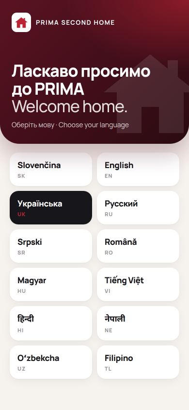 | 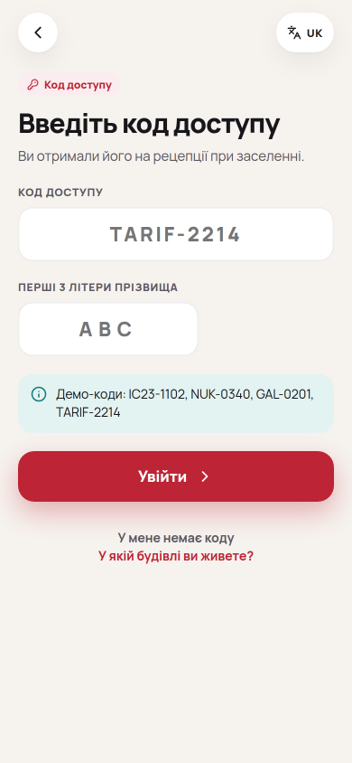 | 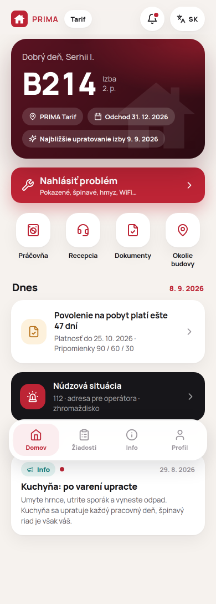 |

| Práčovňa | Okolie budovy | Okolie — úrady |
|---|---|---|
| 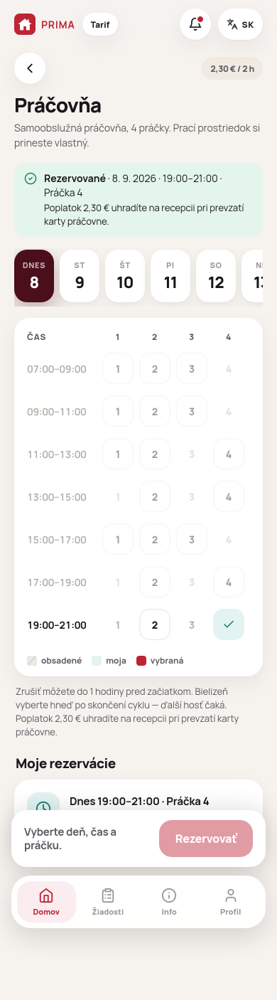 | 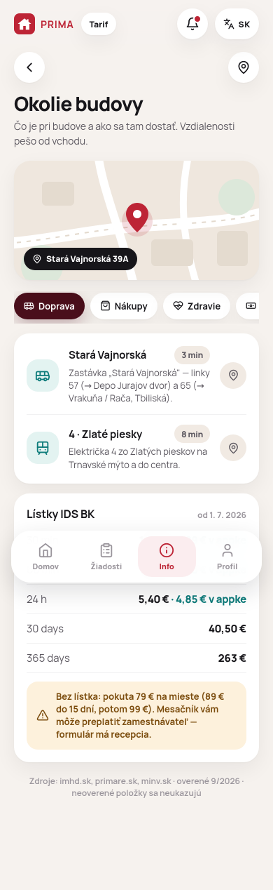 | 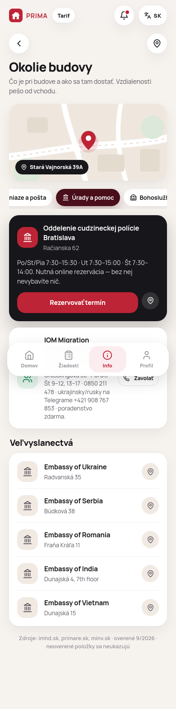 |

| Núdzová situácia | Dokumenty | Súkromné nahlásenie |
|---|---|---|
| 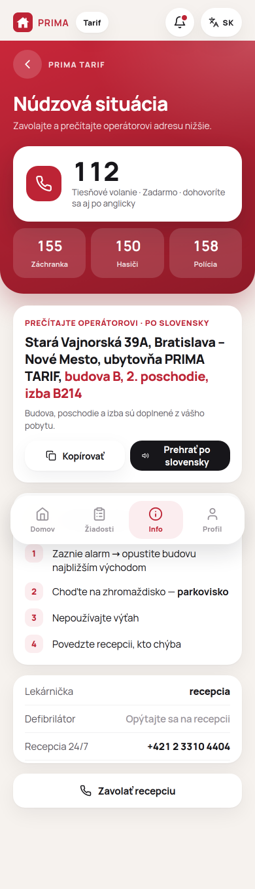 | 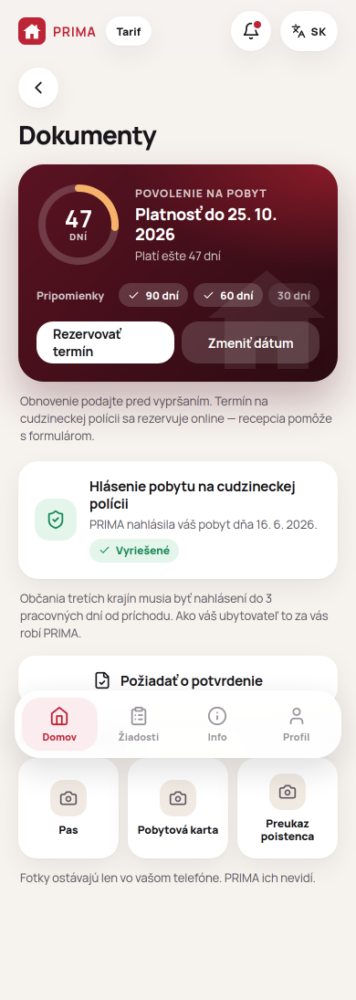 | 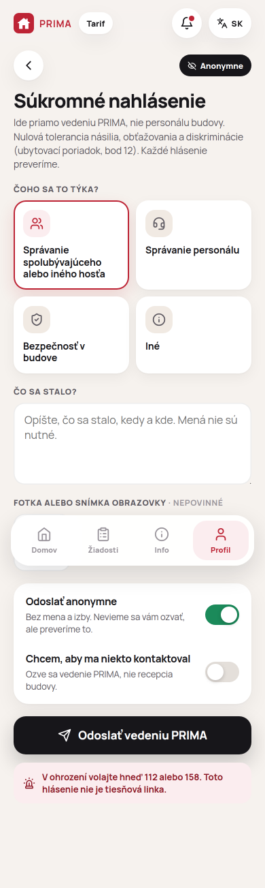 |

| Hlásenie (UK) | Žiadosti (UK) | Info o budove |
|---|---|---|
| 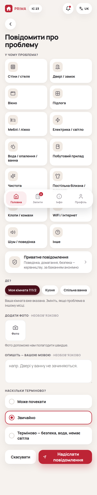 | 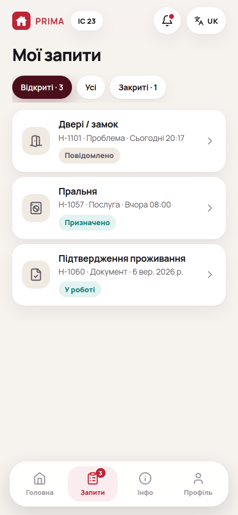 | 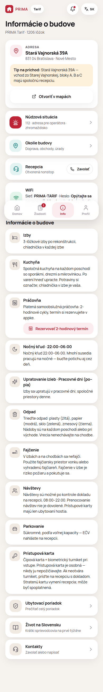 |

| Kontakty (UK) | Profil (UK) | Domov (HI) | Verejný režim (HI) |
|---|---|---|---|
| 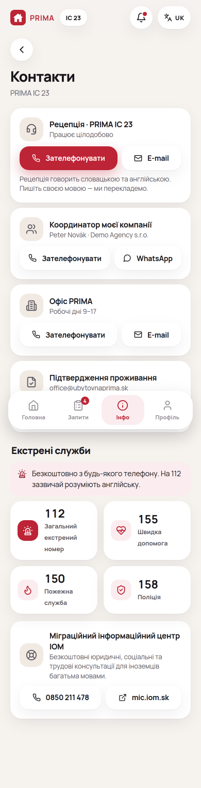 | 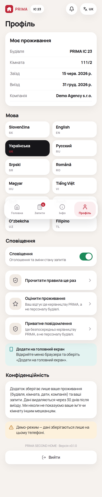 | 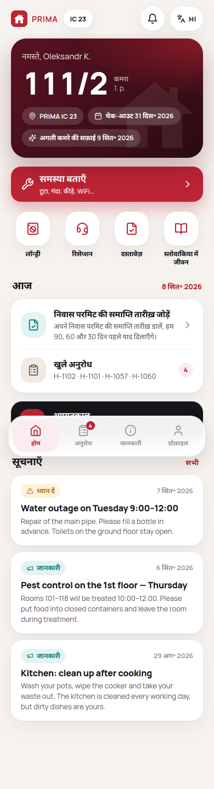 | 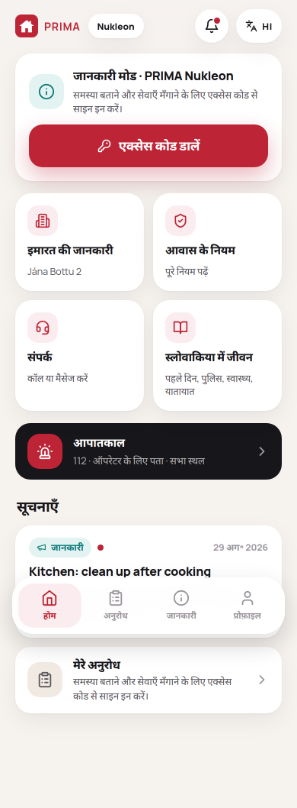 |
