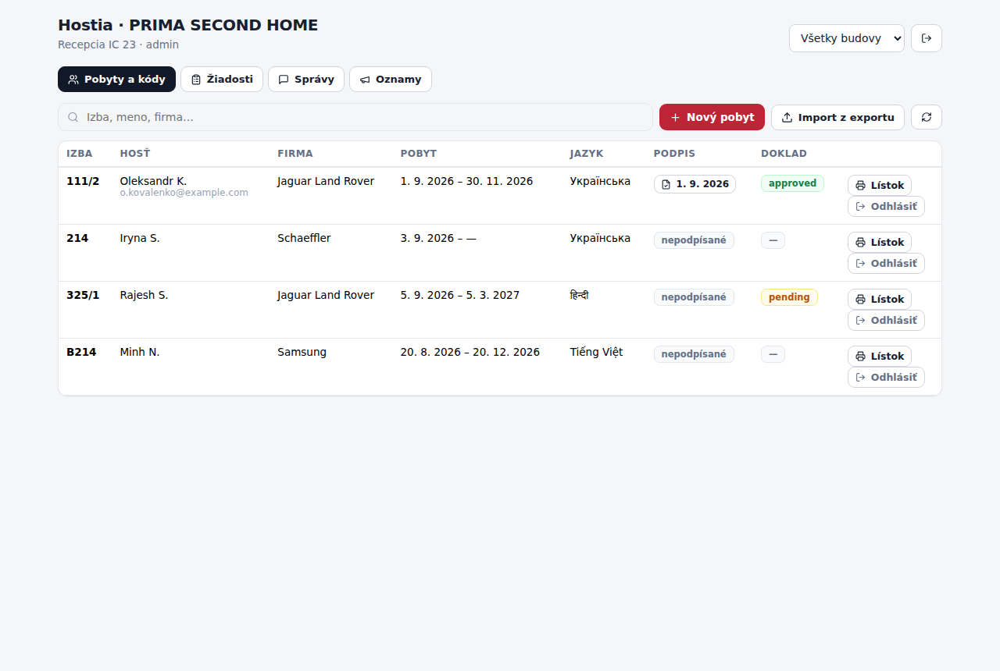
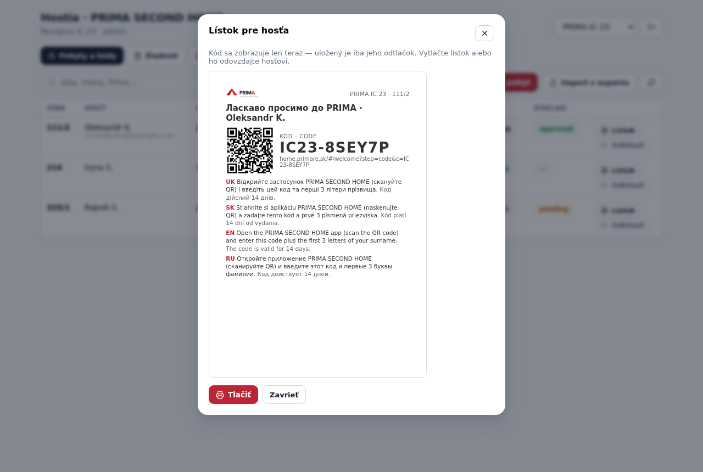
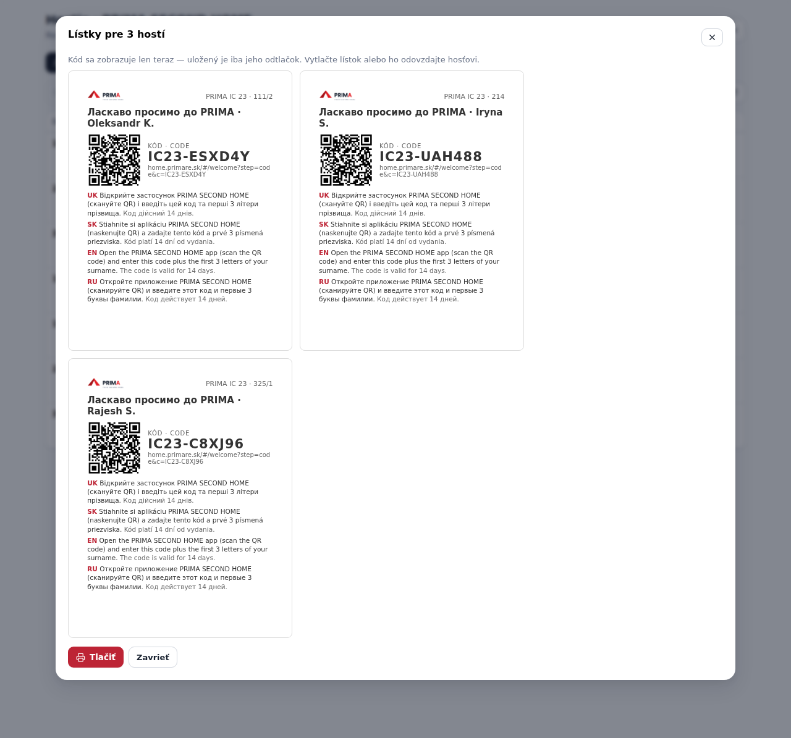
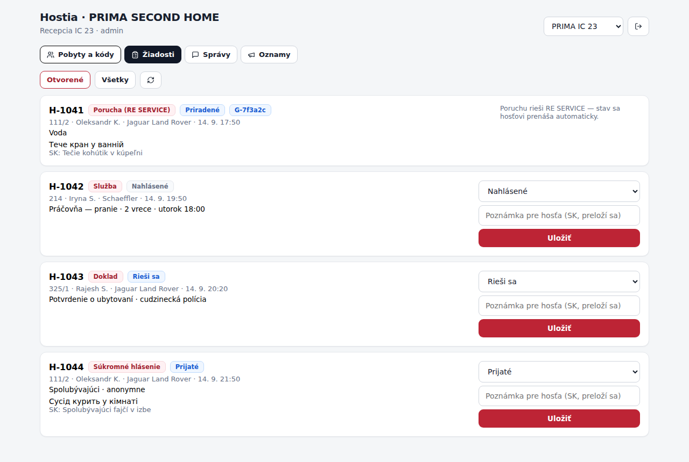
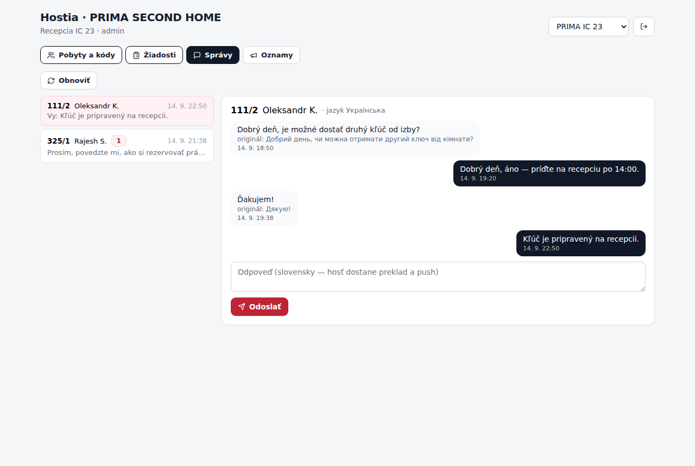
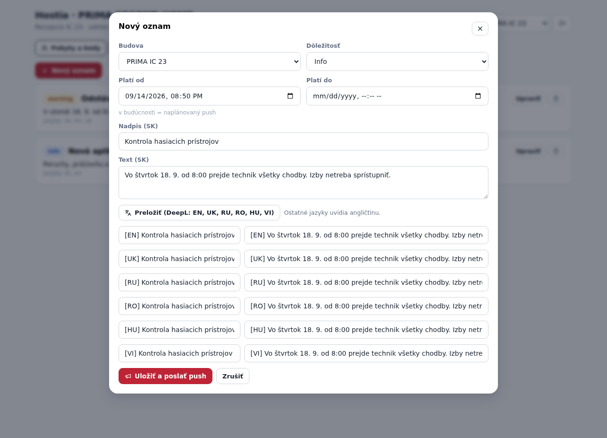

# Modul „Hostia“ pre PRIMA TOOLS (drop-in)

Modul, ktorým recepcia a office spravujú hostí v aplikácii **PRIMA SECOND HOME** priamo
z PRIMA TOOLS: pobyty a kódy (lístok s QR pri check-ine, hromadný import z exportu
ubytovacieho systému), žiadosti hostí, správy s prekladom a oznamy s pushom.

Tento priečinok je pripravený na skopírovanie do repa `prima-tools` (toto repo doň nemá
zápis). Modul používa iba to, čo TOOLS už má: React 18, `lucide-react`, `xlsx`,
`@supabase/supabase-js`, tokeny `src/ui/tokens.js`, komponenty `src/ui/components.jsx`
a UI zo `zamestnanci/ui.jsx` (`ModStyles`, `Badge`, `SearchBox`, `Empty`) a
`vykonnost/ui.jsx` (`btn`, `btnPri`, `mono`, `ModalShell`, `ModStyledExtras`,
`useIsMobile`). Jediná nová závislosť je `qrcode` (QR na lístku).

| | |
|---|---|
|  |  |
|  |  |
|  |  |

## 1. Čo modul robí

| Karta | Funkcie | Tabuľky / RPC v projekte hostí |
|---|---|---|
| **Pobyty a kódy** | zoznam aktívnych pobytov po budovách (hľadanie: izba, meno, firma), stav podpisu ubytovacieho poriadku (otvorí PDF) a overenia dokladu, **Nový pobyt** → založí pobyt + vydá kód + zobrazí lístok, **Import z exportu** (XLSX: Meno, Príchod, Odchod, Izba, Firma) → hromadne založí pobyty a vytlačí lístky 2 × 2 na A4, **Lístok** = nový kód pre existujúci pobyt, **Odhlásiť** = uzavrie pobyt (hosť stratí prístup) | `guest_stays`, `guest_signatures`, `guest_identity`, storage `guest-docs`; RPC `office_create_stay`, `office_issue_code` |
| **Žiadosti** | služby, doklady a súkromné hlásenia hostí (poruchy idú automaticky do RE SERVICE — modul ich len ukazuje so stavom a číslom ticketu); zmena stavu + poznámka pre hosťa po slovensky (webhook `send-push` ju preloží a pošle push) | `guest_requests` (+ `guest_stays` embed) |
| **Správy** | vlákna po hosťoch (neprečítané, preklad do SK), odpoveď po slovensky → webhook preloží do jazyka hosťa + push | `guest_messages` |
| **Oznamy** | oznam pre budovu alebo celú sieť, dôležitosť, platnosť (budúci dátum = naplánovaný push), preklad DeepL do EN/UK/RU/RO/HU/VI, uloženie spustí push | `guest_announcements`, edge funkcia `translate` |

Kód hosťa má tvar `PREFIX-XXXXXX` (napr. `IC23-K66K8N`, abeceda bez 0/O/1/I/L), platí
14 dní, v DB je len jeho odtlačok — preto sa lístok zobrazuje hneď po vydaní a znova sa
nedá vytlačiť (iba vydať nový kód). Hosť v appke zadá kód a prvé 3 písmená priezviska,
QR na lístku otvorí rovno `home.primare.sk/#/welcome?step=code&c=<kód>`.

## 2. Inštalácia do TOOLS (5 krokov)

```bash
# v repe prima-tools
npm i qrcode
cp -r <toto repo>/integrations/tools-hostia/hostia src/modules/hostia
```

`src/config.js` — projekt hostí (nie projekt TOOLS; anon kľúč je verejný):

```js
// PRIMA SECOND HOME (projekt hostí) — modul Hostia
export const HOME_SUPABASE_URL = 'https://<projekt-hosti>.supabase.co';
export const HOME_SUPABASE_ANON_KEY = 'sb_publishable_…';
```

`src/App.jsx` — registrácia modulu (medzi ostatné `lazySafe` importy a do `MODULES`):

```jsx
const Hostia = lazySafe(() => import('./modules/hostia/index.jsx'));

const MODULES = [
  {
    id: 'hostia',
    kluc: 'modul:hostia',
    title: 'Hostia · PRIMA SECOND HOME',
    desc: 'Pobyty a kódy hostí, žiadosti, správy a oznamy v aplikácii pre ubytovaných.',
    icon: Users,          // z lucide-react (App.jsx ho už importuje)
    component: Hostia,
    ready: true,
    wide: true,           // tabuľky a lístky využijú celú šírku
  },
  // …ostatné moduly
];
```

`src/perms.js` — kľúč do matice oprávnení, aby ho admin vedel prideliť:

```js
{ kluc: 'modul:hostia', l: 'Hostia · PRIMA SECOND HOME', typ: 'Modul' },
```

Potom `npm run build` (overené: buduje sa bez chýb, viď §5) a v Admine prideliť
`modul:hostia` recepcii.

## 3. Účty recepcie v projekte hostí

Modul sa do projektu hostí prihlasuje **druhým účtom** (e-mail + heslo), nezávisle od
prihlásenia do TOOLS — session je v `localStorage` pod kľúčom `prima-home-office`.
Účet a jeho práva sa zakladajú podľa `docs/SETUP_SUPABASE.md §6b`:

1. Authentication → Users → Add user (e-mail + heslo).
2. Riadok v `office_users` (`role`: `reception` / `manager` vidia len svoje
   `property_ids`, `admin` všetky budovy).

Bez riadku v `office_users` modul po prihlásení ukáže chybu „Tento účet nemá záznam
v office_users“. RLS v projekte hostí púšťa office účtom len tabuľky hostí
(`is_office()`, `office_property_ok()`), service-role kľúč sa v TOOLS nikde nepoužíva.

## 4. Súbory

| Súbor | Obsah |
|---|---|
| `hostia/index.jsx` | modul (login, karty Pobyty / Žiadosti / Správy / Oznamy, modaly) |
| `hostia/api.js` | klient projektu hostí (`createClient` s vlastným `storageKey`), všetky čítania/zápisy |
| `hostia/model.js` | čistá logika bez Reactu: `genCode`, `normSurname` (zrkadlo `guest_norm_surname`), `parseStaysRows` (hlavičky bez diakritiky: meno / príchod / odchod / izba / firma / poznámka; dátumy `15.6.2026`, ISO, Excel sériové číslo), texty lístka v 12 jazykoch, `slipLangs` (jazyk hosťa + SK + EN + UK + RU) |
| `hostia/Slip.jsx` | lístok A6 (QR cez `qrcode`), tlačové štýly (2 × 2 na A4 pri hromadnej tlači) |
| `harness/` | overenie v prehliadači bez živého Supabase (§5) |

Testy logiky bežia v tomto repe: `node --test test/tools-hostia-model.test.mjs`
(kódy, normalizácia priezviska zhodná s appkou, mená, dátumy, import, lístok).

## 5. Ako bol modul overený

1. **Build v TOOLS:** kópia repa `prima-tools` + modul + úpravy z §2 → `vite build`
   prešiel (modul sa načíta lenivo ako samostatný chunk).
2. **Runtime harness** (`harness/`): samostatná stránka `hostia.html` renderuje modul
   s `GlobalStyles` TOOLS; Playwright cez `page.route` nahrádza celý Supabase projekt
   hostí (auth `token`, PostgREST tabuľky, RPC, `functions/v1/translate`, storage
   `sign`) a prejde: zlé heslo → chyba, prihlásenie, filter budovy a hľadanie, lístok
   s QR (kód `IC23-XXXXXX`, URL do appky, `window.print`), otvorenie PDF podpisu,
   nový pobyt → lístok, import XLSX (3 hostia + 1 preskočený riadok) → 3 lístky,
   zmena stavu žiadosti s poznámkou (PATCH `status` + `timeline`), správy (označenie
   prečítaných, odpoveď), oznam (preklad, uloženie so 7 jazykmi), odhlásenie — na
   desktope (1280 px) aj mobile (390 px), bez JS chýb.

Zopakovanie: skopírovať `harness/hostia.html`, `harness/vite.hostia.config.js` do
koreňa kópie TOOLS a `harness/main-hostia.jsx` do jej `src/`, v kópii spraviť kroky
§2 (s ľubovoľnou `HOME_SUPABASE_URL = 'https://example.supabase.co'`), potom:

```bash
node harness/make-export.mjs export-hostia.xlsx           # vzorový XLSX (v kópii TOOLS)
npx vite build --config vite.hostia.config.js             # dist-hostia/
SCR=<kópia TOOLS> OUT=<priečinok> NPM_GLOBAL_ROOT=<kde je playwright> node harness/hostia-harness.mjs
```

## 6. Čo ešte nie je (zámerne)

- Editácia pobytu po založení (izba, odchod, e-mail) — zatiaľ len `updateStay` v `api.js`
  bez UI; recepcia pobyt uzavrie a založí nový.
- Koordinátori firiem (kontakt v appke hosťa) sa zadávajú pri novom pobyte, nie hromadne.
- Import predpokladá prvý hárok exportu a hlavičky v prvom riadku; iný tvar → riadky sa
  preskočia a ukáže sa počet.
